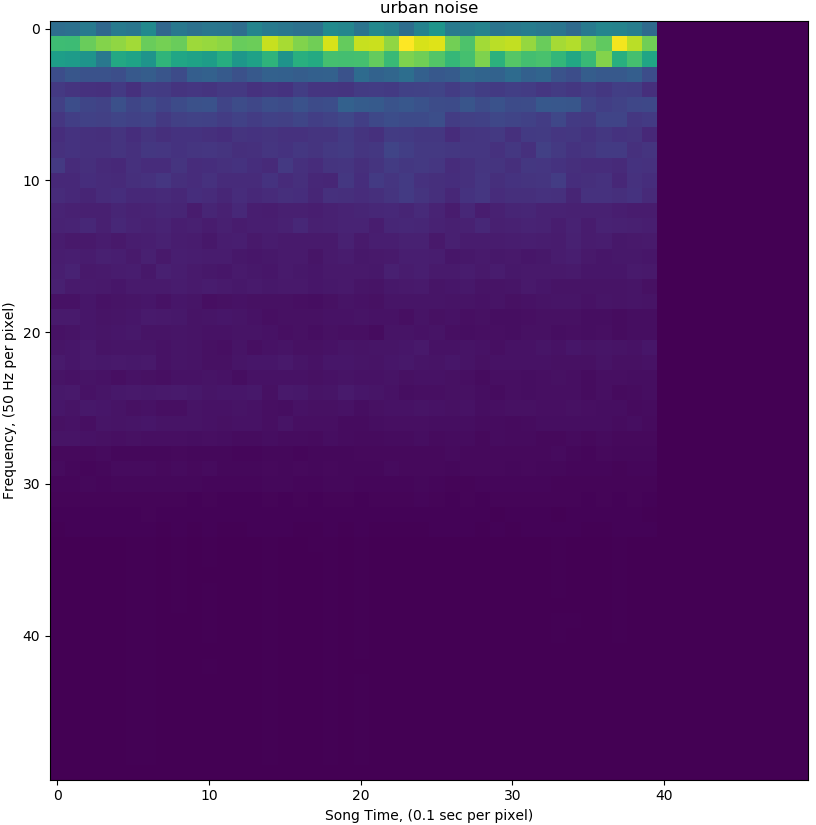

# Spectogram Classification

The aim of this is to see I can classify urban sounds accurately.  I used the [Urban sound 8k](https://serv.cusp.nyu.edu/projects/urbansounddataset/urbansound8k.html) dataset for my training and evaluation.  I decided to use Tensorflow for the classification due to it's extensive api and documentation.

## Spectogram

To create the Spectogram I performed an FFT on each wav file to produce a frequency intensity image (AKA spectogram).  The image frequencies included in the image are capped at 2500 Hz and have a resolution of 50 Hz.  This gives an image size of 50 pixels by 50 pixels with each x-axis pixel representing a 0.1 sec section in the song and each y-axis pixel representing a 50Hz segment in the frequency domain.

## Classification model

To train the tensorflow model simply run [Audio Classification.py](AudioClassification.py).  Once trained it should achieve ~87%.  I probably didn't evaluate it properly so it might be a little off.  You can then use the [prediction script](PredictAudio.py) to have it classify 20 hand chosen wav files to see how it does.
